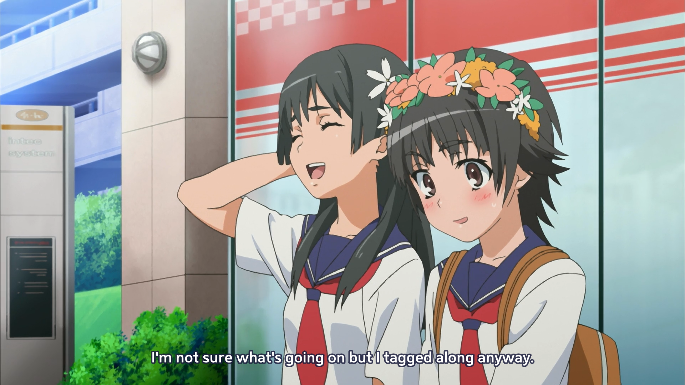
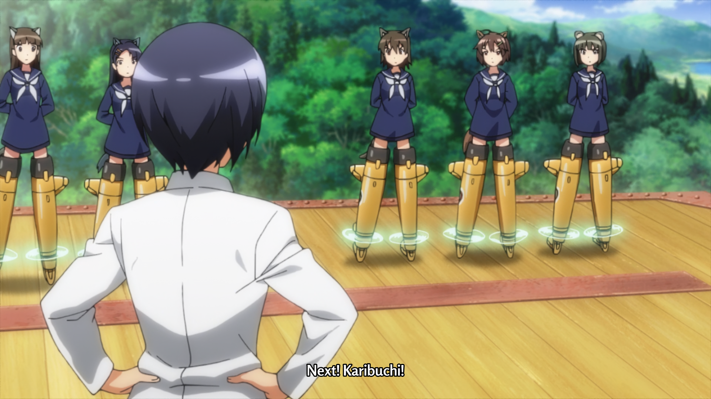

# normalasser

_Normalasser_ extracts ASS subtitles from MKV video files and normalizes their appearance to enhance readability and ensure consistency. Unlike the simpler SRT format, ASS subtitles include embedded styles that dictate font, color, and size, leaving no room for viewer preferences. _Normalasser_ selectively overrides these styles to ensure that subtitles maintain a consistent size across different series and sources, while preserving other stylistic elements such as font choice, color, and positioning. This approach not only improves viewer experience but also upholds the original artistic intent of the subtitles.

# Preview

<table width="100%">
  <tr>
    <td width="50%">Before</td>
    <td width="50%">After</td>
  </tr>
  <tr>
    <td width="50%"></td>
    <td width="50%"></td>
  </tr>
  <tr>
    <td width="50%"></td>
    <td width="50%"></td>
  </tr>
  <tr>
    <td width="50%"></td>
    <td width="50%"></td>
  </tr>
</table>

# Prerequisites

- [`node`](http://nodejs.org/) >= `20`
- [`npm`](https://www.npmjs.org/) >= `10`
- [`ffmpeg`](https://ffmpeg.org/) >= `6`
- [`ffprobe`](https://ffmpeg.org/) >= `6`

# Install

```
npm install -g normalasser
```

# Usage

To use _Normalasser_ from the command line, simply run the tool followed by the absolute paths to the MKV files or directories containing MKV files. _Normalasser_ will recursively scan directories to find all MKV files to extract and normalize ASS subtitles according to your specifications.

```
normalasser /path/to/video.mkv
```

You can also pass multiple paths:

```
normalasser /path/to/directory /path/to/video.mkv
```

Customize _Normalasser_'s behavior with the following options:

- `--check-ass`: Normalize already extracted ASS subtitles.
- `--force-mkv`: Extract and normalize even if external ASS subtitles already exist.
- `--size`: Set the size of the subtitles (`tiny`, `small`, `normal`, `large` or `huge`).

Example with multiple options:

```
normalasser --check-ass --size large /path/to/directory
```

# Webserver

If no absolute paths are specified when launching _Normalasser_, it operates as a webserver on port `7883`. This mode enables other applications to send POST requests with JSON payloads containing absolute paths to the MKV files or directories containing MKV files.

```
normalasser
```

To send a request, use any HTTP client capable of sending POST requests with JSON:

```
curl -X POST -d '{"path": "/path/to/video.mkv"}' http://127.0.0.1:7883
```

_Normalasser_ scans the entire JSON object, extracting absolute paths from any part of its structure, regardless of how it is formatted. This flexibility ensures that _Normalasser_ is compatible with a wide range of input sources and can be integrated with automation tools like _Sonarr_ and _Radarr_ that may send structured data in different formats.

# Contributions

We welcome contributions from the community! If you have suggestions for improvements, bug fixes, or new features, please feel free to submit a pull request or open an issue on our GitHub page. Your feedback and contributions make _Normalasser_ better for everyone.
